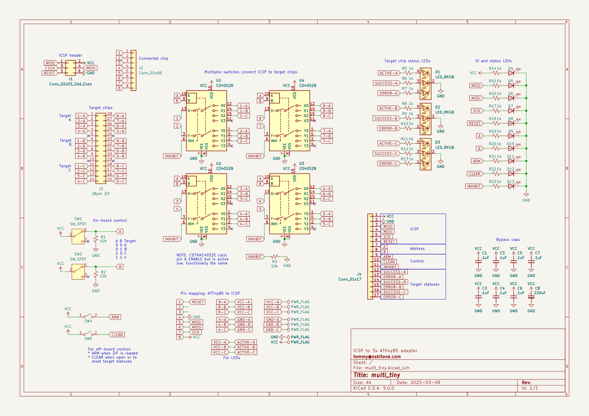

# multi_tiny

Thinking about an adapter board to connect multiple ATtiny85s to a single programmer using off-the-shelf DIP parts.

_Incredibly_ work-in-progress.

## Requirements / Goals

- Long ZIF socket for fast engagement on multiple chips simultaneously
- Programming is done on each chip individually
- Each chip can connect to target PCB for manual testing
- Support for both manual chip and auto/digital chip selection
- Indicators for board/chip-level statuses
- ~Chainable

## Open questions / Down the line / Considerations

- Do I really need four discrete, per-chip pins to program? Sharing common pins and only multiplexing the minimum could simplify BOM.
- Standalone operation w/o a big computer. Raspberry Pi? SD card for storing hex?
- Queue system: load ZIF and mark ready for programming. LEDs indicate when they're ready, and they can be removed while other ZIFs are being used.
- Arbitrary pin routing to support other chips, pin counts, and number of chips per socket
- For now, intentionally not pursuing...
  - Chip switching could be done with manual switches instead of multiplexers. They'd be weird and expensive and obviously not digitally controllable.
  - Programming chips in parallel is feasible (and, anecdotally, commonplace) but require extra verification to test.
  - Could skip multiplexers and instead use multiple sets of GPIO for ICSP pins. It moves a a lot of the complexity into software, which might be nice! Cons: heavily coupled to specific tech, connecting to a target PCB less straightforward.
  - I'm using the 28 pin ZIF because that's what I have for programming the ATmega328. 32 and 40 pin ZIFs have wider pin spacings but, if I'm reading correctly, may still work for DIP8 chipss.

## `DATE REV 2503`

### Schematic

### BOM

| Designator | Footprint                                         | Quantity | Designation         |
| ---------- | ------------------------------------------------- | -------- | ------------------- |
| C1 to C7   | C_Disc_D5.0mm_W2.5mm_P5.00mm                      | 7        | .1uF                |
| C8         | CP_Radial_D8.0mm_P3.50mm                          | 1        | 220uF               |
| D1 to D3   | LED_D5.0mm-4_RGB_Staggered_Pins                   | 3        | LED_RKGB            |
| D4 to D13  | LED_D3.0mm                                        | 10       | LED                 |
| J1         | PinHeader_2x03_P2.54mm_Vertical                   | 1        | Conn_02x03_Odd_Even |
| J2         | PinHeader_1x08_P2.54mm_Vertical                   | 1        | Conn_01x08          |
| J3         | DIP-28_W7.62mm_LongPads                           | 1        | 28pin ZIF           |
| J4         | PinHeader_1x17_P2.54mm_Vertical                   | 1        | Conn_01x17          |
| R1 to R3   | R_Axial_DIN0207_L6.3mm_D2.5mm_P10.16mm_Horizontal | 3        | 10k                 |
| R5 to R23  | R_Axial_DIN0207_L6.3mm_D2.5mm_P2.54mm_Vertical    | 19       | 1k                  |
| SW1, SW2   | SW_Slide_SPDT_Straight_CK_OS102011MS2Q            | 2        | SW_SPDT             |
| SW4, SW5   | SW_PUSH_6mm                                       | 2        | SW_SPST             |
| U1 to U4   | DIP-16_W7.62mm_Socket_LongPads                    | 4        | CD4052B             |

## License

Designed by Oskitone. Please support future projects by purchasing from [Oskitone](https://www.oskitone.com/).

Creative Commons Attribution/Share-Alike, all text above must be included in any redistribution. See license.txt for additional details.
